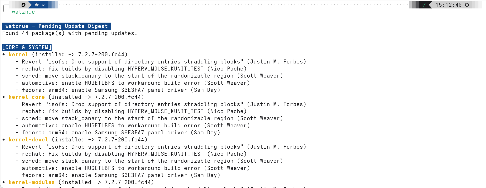

# watznue

> **watznue** (*"What's new?"*) — Modular, lean update digest & changelog inspector.

`watznue` inspects pending package updates on your Linux system (Fedora DNF5 / DNF4), aggregates advisory metadata from Fedora Bodhi and local package databases, and renders a clean, prioritized digest before you apply updates.

Written in pure, native Rust for sub-10ms startup, single-binary distribution, and zero runtime dependencies.

---

## Features

- **Blazing Fast**: Sub-5ms cached execution time; local disk caching in `~/.cache/watznue/`.
- **Signal over Noise**: Automatically classifies updates into intuitive tiers:
  - **Security & Critical** (CVEs, security advisories)
  - **Core & System** (Kernel, systemd, PipeWire, Mesa)
  - **Desktop & UX** (GNOME, Mutter, Wayland compositors)
  - **User Applications** (Firefox, productivity apps)
  - **Libraries & Development**
- **Resilient Bullet Extraction**: Cleans messy RPM specfiles and Bodhi notes into concise, readable bullet points while filtering out packaging boilerplate.
- **Multiple Output Formats**: High-contrast terminal output, GitHub Flavored Markdown (for Obsidian/notes), and structured JSON.
- **Standalone & Unprivileged**: Runs without `sudo` or forced package manager hooks.
- **License**: GNU General Public License v3.0 (GPL-3.0-or-later).

---

## Installation & Build

### Requirements
Rust 1.75+ and Cargo.

```bash
# Clone and build optimized release binary
git clone https://github.com/ManuelSaleta/watznue.git
cd watznue
cargo build --release

# Install to ~/.local/bin
cargo install --path crates/watznue-cli
```

---

## Setup: Download & Use as a Command

Follow this step-by-step guide to clone the repository, build `watznue`, and configure it so the `watznue` command can be executed from anywhere in your terminal.

### 1. Prerequisites
Ensure Git and the Rust toolchain (Rust 1.75+ and Cargo) are installed:

- **Fedora / RHEL**:
  ```bash
  sudo dnf install git cargo rust
  ```
- **Universal (via rustup)**:
  ```bash
  curl --proto '=https' --tlsv1.2 -sSf https://sh.rustup.rs | sh
  ```

### 2. Download the Project
Clone the repository using `git` and enter the directory:

```bash
git clone https://github.com/ManuelSaleta/watznue.git
cd watznue
```

### 3. Setup `watznue` to Use as a Command

Choose one of the following methods to install the binary to your shell `$PATH`:

#### Method 1: Install via Cargo (Recommended)

Install the binary directly into Cargo's binary directory:

```bash
cargo install --path crates/watznue-cli
```

> **Note:** Ensure Cargo's bin directory (`~/.cargo/bin`) is in your `$PATH`. If not already configured, add it by running:
> ```bash
> echo 'export PATH="$HOME/.cargo/bin:$PATH"' >> ~/.bashrc
> source ~/.bashrc
> ```

#### Method 2: Install to `~/.local/bin` (User PATH)

Modern Linux distributions (such as Fedora) include `~/.local/bin` in your `$PATH` by default:

```bash
# Option A: Using cargo install with custom root
cargo install --path crates/watznue-cli --root ~/.local

# Option B: Building release binary and copying
cargo build --release
mkdir -p ~/.local/bin
cp target/release/watznue ~/.local/bin/
```

#### Method 3: System-Wide Installation

To make `watznue` available for all users on the system:

```bash
cargo build --release
sudo cp target/release/watznue /usr/local/bin/
```

### 4. Verify Command

Once set up, confirm that `watznue` is available from any directory:

```bash
# Verify the binary is detected in your PATH
which watznue

# Run with demo data to test output
watznue --demo
```

---

## Usage Examples

```bash
# 1. Check system pending updates live (via DNF5 / DNF4)
watznue

# 2. Preview digest using demo packages (even if system is up to date)
watznue --demo

# 3. Inspect specific packages
watznue kernel mesa mutter firefox

# 4. Filter by category or security only
watznue --demo --category desktop
watznue --demo --security-only

# 5. Export to Markdown (ideal for saving to Obsidian notes)
watznue --demo --format markdown

# 6. Export to machine-readable JSON
watznue --demo --format json
```

## Output Examples



### Output Text Examples

```text
Found 44 package(s) with pending updates.

[CORE & SYSTEM]
• kernel (installed -> 7.2.7-200.fc44)
    - Revert "isofs: Drop support of directory entries straddling blocks" (Justin M. Forbes)
    - redhat: fix builds by disabling HYPERV_MOUSE_KUNIT_TEST (Nico Pache)
    - sched: move stack_canary to the start of the randomizable region (Scott Weaver)
    - automotive: enable HUGETLBFS to workaround build error (Scott Weaver)
    - fedora: arm64: enable Samsung S6E3FA7 panel driver (Sam Day)
• kernel-core (installed -> 7.2.7-200.fc44)
    - Revert "isofs: Drop support of directory entries straddling blocks" (Justin M. Forbes)
    - redhat: fix builds by disabling HYPERV_MOUSE_KUNIT_TEST (Nico Pache)
    - sched: move stack_canary to the start of the randomizable region (Scott Weaver)
    - automotive: enable HUGETLBFS to workaround build error (Scott Weaver)
    - fedora: arm64: enable Samsung S6E3FA7 panel driver (Sam Day)
• kernel-devel (installed -> 7.2.7-200.fc44)
    - Revert "isofs: Drop support of directory entries straddling blocks" (Justin M. Forbes)
    - redhat: fix builds by disabling HYPERV_MOUSE_KUNIT_TEST (Nico Pache)
    - sched: move stack_canary to the start of the randomizable region (Scott Weaver)
    - automotive: enable HUGETLBFS to workaround build error (Scott Weaver)
    - fedora: arm64: enable Samsung S6E3FA7 panel driver (Sam Day)
• kernel-modules (installed -> 7.2.7-200.fc44)
    - Revert "isofs: Drop support of directory entries straddling blocks" (Justin M. Forbes)
    - redhat: fix builds by disabling HYPERV_MOUSE_KUNIT_TEST (Nico Pache)
    - sched: move stack_canary to the start of the randomizable region (Scott Weaver)
    - automotive: enable HUGETLBFS to workaround build error (Scott Weaver)
    - fedora: arm64: enable Samsung S6E3FA7 panel driver (Sam Day)
• kernel-modules-core (installed -> 7.2.7-200.fc44)
    - Revert "isofs: Drop support of directory entries straddling blocks" (Justin M. Forbes)
    - redhat: fix builds by disabling HYPERV_MOUSE_KUNIT_TEST (Nico Pache)
    - sched: move stack_canary to the start of the randomizable region (Scott Weaver)
    - automotive: enable HUGETLBFS to workaround build error (Scott Weaver)
    - fedora: arm64: enable Samsung S6E3FA7 panel driver (Sam Day)
• kernel-modules-extra (installed -> 7.2.7-200.fc44)
    - Revert "isofs: Drop support of directory entries straddling blocks" (Justin M. Forbes)
    - redhat: fix builds by disabling HYPERV_MOUSE_KUNIT_TEST (Nico Pache)
    - sched: move stack_canary to the start of the randomizable region (Scott Weaver)
    - automotive: enable HUGETLBFS to workaround build error (Scott Weaver)
    - fedora: arm64: enable Samsung S6E3FA7 panel driver (Sam Day)
• kernel-tools (installed -> 7.2.7-200.fc44)
    - Revert "isofs: Drop support of directory entries straddling blocks" (Justin M. Forbes)
    - redhat: fix builds by disabling HYPERV_MOUSE_KUNIT_TEST (Nico Pache)
    - sched: move stack_canary to the start of the randomizable region (Scott Weaver)
    - automotive: enable HUGETLBFS to workaround build error (Scott Weaver)
    - fedora: arm64: enable Samsung S6E3FA7 panel driver (Sam Day)
• kernel-tools-libs (installed -> 7.2.7-200.fc44)
    - Revert "isofs: Drop support of directory entries straddling blocks" (Justin M. Forbes)
    - redhat: fix builds by disabling HYPERV_MOUSE_KUNIT_TEST (Nico Pache)
    - sched: move stack_canary to the start of the randomizable region (Scott Weaver)
    - automotive: enable HUGETLBFS to workaround build error (Scott Weaver)
    - fedora: arm64: enable Samsung S6E3FA7 panel driver (Sam Day)
• mesa-dri-drivers (installed -> 26.2.3-1.fc44)
    - Update to 26.2.3-1.fc44
• mesa-dri-drivers (installed -> 26.2.3-1.fc44)
    - Update to 26.2.3-1.fc44
• mesa-filesystem (installed -> 26.2.3-1.fc44)
    - Update to 26.2.3-1.fc44
• mesa-filesystem (installed -> 26.2.3-1.fc44)
    - Update to 26.2.3-1.fc44

[APPLICATIONS]
• code (installed -> 1.139.0-1790100890.el8)
    - Update to 1.139.0-1790100890.el8

[LIBRARIES & DEVELOPMENT]
• python3-perf (installed -> 7.2.7-200.fc44)
    - Revert af_alg_restrict sysctl for F43/44 (Justin M. Forbes)
    - redhat: configs: fedora: Enable CONFIG_FIREWIRE_KUNIT_NODE_TREE_TEST for x86 (Augusto Caringi)
    - redhat/configs/fedora: Enable dwc dual-role and ulpi phy support (Hans de Goede)
    - redhat/configs/fedora: Enable some drivers for x86 tablets (Hans de Goede)

[OTHER UPDATES]
• aspnetcore-runtime-10.0 (installed -> 10.0.12-1.fc44)
    - Update to .NET SDK 10.0.111 and Runtime 10.0.11
    - Update to .NET SDK 10.0.110 and Runtime 10.0.10
    - Update to .NET SDK 10.0.109 and Runtime 10.0.9
    - Update to .NET SDK 10.0.108 and Runtime 10.0.8

```
---

## Comparison with Existing Tools

Most package inspection tools either only display raw version jumps (`package 1.0 -> 1.1`), dump unfiltered packaging logs full of maintainer churn (`rebuilt for Python 3.13`, spec cleanups), or rely on slower interpreted runtimes. Written in native Rust for speed and a tiny footprint, `watznue` bridges this gap by transforming update metadata into an actionable, categorized digest.

| Tool | Ecosystem | Changelog Parsing & Cleanup | Domain Tiering (Core / Desktop / Apps) | Advisory & CVE Aware | Export Formats |
| :--- | :--- | :--- | :--- | :--- | :--- |
| **`watznue`** | **Fedora (DNF5 / DNF4)** | **Yes (Heuristic bullet extraction)** | **Yes (5 categorized tiers)** | **Yes (Bodhi REST API)** | **Terminal, Markdown, JSON** |
| `apt-listchanges` | Debian / Ubuntu | Partial (Raw Debian changelogs) | No (Severity-only filtering) | Yes (Urgency flags) | Terminal pager, Mail |
| `dnf updateinfo` | Fedora / RHEL | No (Raw Bodhi XML) | No (Bugfix/Enhancement/Security only) | Yes (Advisory IDs / CVEs) | Verbose terminal text |
| `nvd` | NixOS | No (Version / closure size diff) | Partial (By dependency closure) | No | Terminal diff |
| `rpm-ostree db diff` | Fedora Atomic | No (Raw RPM changelog) | No | No | Terminal text |
| `tui-update` | DNF / Pacman / APT | No (Version jumps only) | No (By repository) | Partial | Interactive TUI |

### Why is `watznue` Different?

- **Speed & Minimal Footprint (Pure Rust):** Many package tools and DNF plugins rely on interpreted Python runtimes with noticeable startup overhead and dependency bloat. `watznue` is compiled to a standalone native Rust binary delivering sub-10ms execution, a minimal memory and binary footprint, zero runtime dependencies, and positive/negative disk caching—running completely unprivileged without `sudo`.
- **Signal Over Noise:** Traditional commands like `dnf changelog` dump hundreds of lines of spec file churn. `watznue` strips packaging boilerplate (rebuild notices, commit hashes, maintainer email signatures) to isolate user-relevant release bullets.
- **Domain-Aware Classification:** Updates are automatically categorized into intuitive tiers (`[CORE & SYSTEM]`, `[DESKTOP & UX]`, `[APPLICATIONS]`, etc.). You can immediately spot whether an update touches critical low-level components (Kernel, Mesa, systemd), impacts your desktop session (Mutter, Wayland), or is just an isolated user application.
- **Bodhi REST API Integration:** Instead of relying solely on local RPM spec files, `watznue` queries Fedora Bodhi directly for official update descriptions and security advisories, falling back to local changelogs when offline.
- **Documentation Ready:** Built-in Markdown export (`--format markdown`) is specifically formatted for note-taking systems (such as Obsidian) and changelog tracking, while JSON export enables easy shell scripting.

---

## Workspace Structure

```
watznue/
├── Cargo.toml               # Cargo workspace manifest
├── LICENSE                  # GNU General Public License v3.0
├── README.md
└── crates/
    ├── watznue-core/        # Headless domain engine (library)
    │   ├── Cargo.toml
    │   └── src/
    │       ├── lib.rs
    │       ├── models.rs    # Data models & schema
    │       ├── detector.rs  # DNF5 / DNF4 package discovery
    │       ├── sources.rs   # Bodhi REST API client & local changelog fallback
    │       ├── normalizer.rs# Heuristic bullet extractor & classifier
    │       └── cache.rs     # Positive/negative disk caching
    └── watznue-cli/         # Standalone command-line binary
        ├── Cargo.toml
        └── src/
            ├── main.rs      # CLI entrypoint (clap derive)
            └── formatters.rs# Terminal, Markdown, and JSON renderers
```

---

## Roadmap

- [x] **Milestone 1**: Problem validation & heuristic extraction (POC).
- [x] **Milestone 2**: Native Rust core (`watznue-core`) & standalone CLI (`watznue-cli`).
- [ ] **Milestone 3**: Configuration parser (`~/.config/watznue/config.toml`) & RPM packaging.
- [ ] **Milestone 4**: Interactive terminal browser (`watznue-tui` with `ratatui`).
- [ ] **Milestone 5**: Native GTK4/Libadwaita desktop companion (`watznue-gui` with `relm4`).


